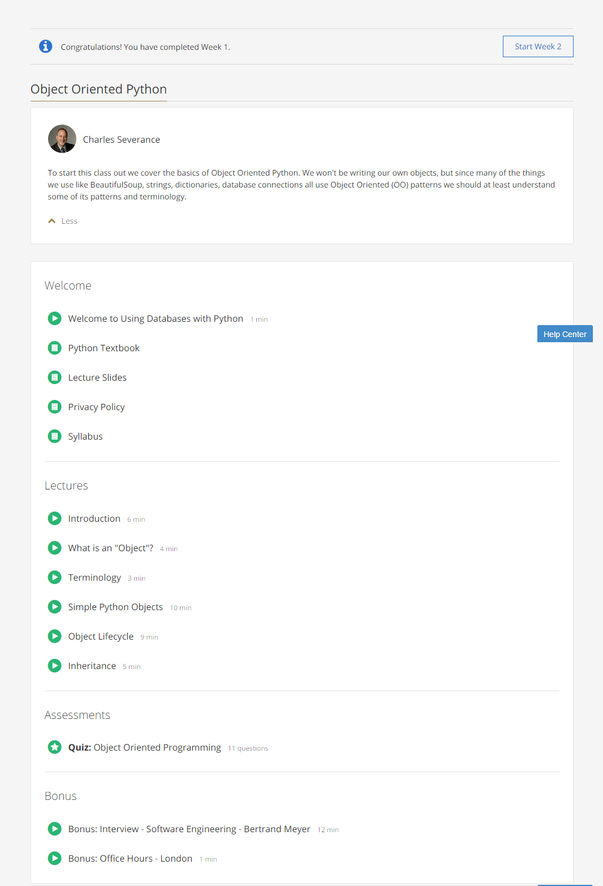

### Week 1: Object Oriented Python

Week 1 covers a high-level overview of OOP concepts: classes, objects, class methods and attributes,
constructors, destructors, and inheritance.
These are the contents of week 1 of the course:  

 

[Back to course notes](../Course_Notes.md)
