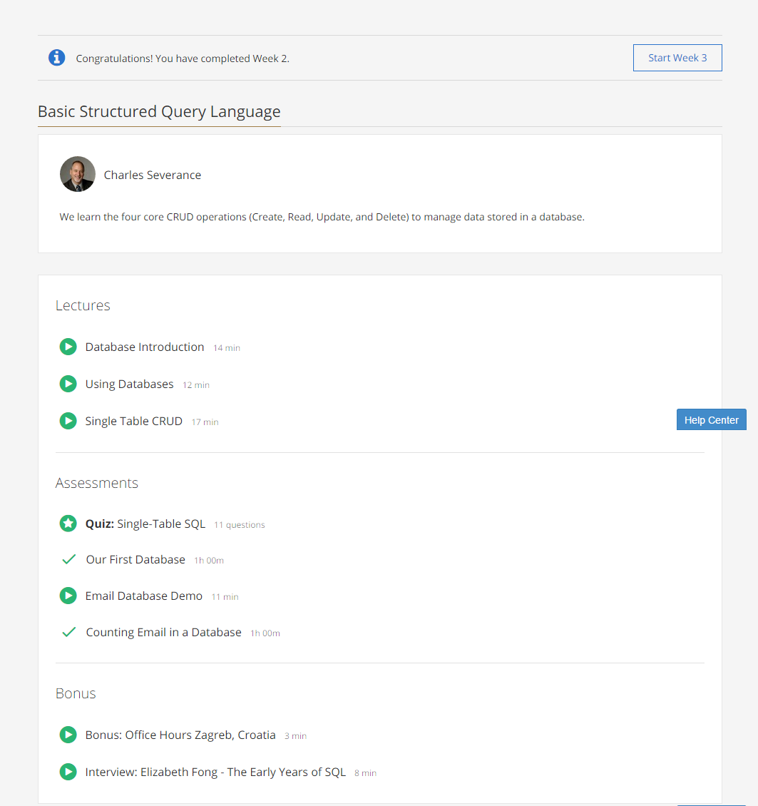
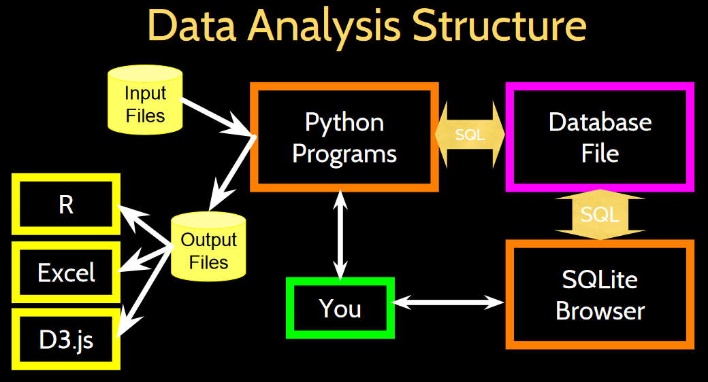

### Week 2: Basic Structured Query Language

These are the contents of week 2 of the course:  

The [SQLite Database Browser](http://sqlitebrowser.org/) is the recommended tool for exercises in this course.

* **Database Introduction**:
  * Heirarchy:
    * Database
    * Relation / table
    * Tuple / row / object
    * Attributes / column / field
  * Basic Operations: CRUD
    * Create
    * Read
    * Update
    * Delete

* **Using Databases**:
  * Large projects generally have two roles: application developer and the DB administrator.
  * The data analysis structure is as shown below:  
  
  * Major DBMS in wide use: Oracle, MySql, SqlServer. Other smaller projects: SQLite, HSQL, Postgres.
  
* **Single Table CRUD**:
  * Creating a table:  
  `CREATE TABLE <table_name>(
  <attribute_name_1> <type_1>(length_1),
  <attribute_name_2> <type_2>(length_2)
  )`
  * Inserting a record:  
  `INSERT INTO <table_name> (<attribute names separated by a comma>) VALUES (<values separated by a comma>)`
  * Deleting a record:  
  `DELETE FROM <table_name> WHERE <condition>`
  * Updating a record:  
  `UPDATE <table_name> SET <attribute_name>=<value> WHERE <condition>`
  * Retreaving records:
  `SELECT <list of attributes or * for all columns> FROM Users WHERE <condition> ORDER BY <attribute_name>`

 

[Back to course notes](../Course_Notes.md)
