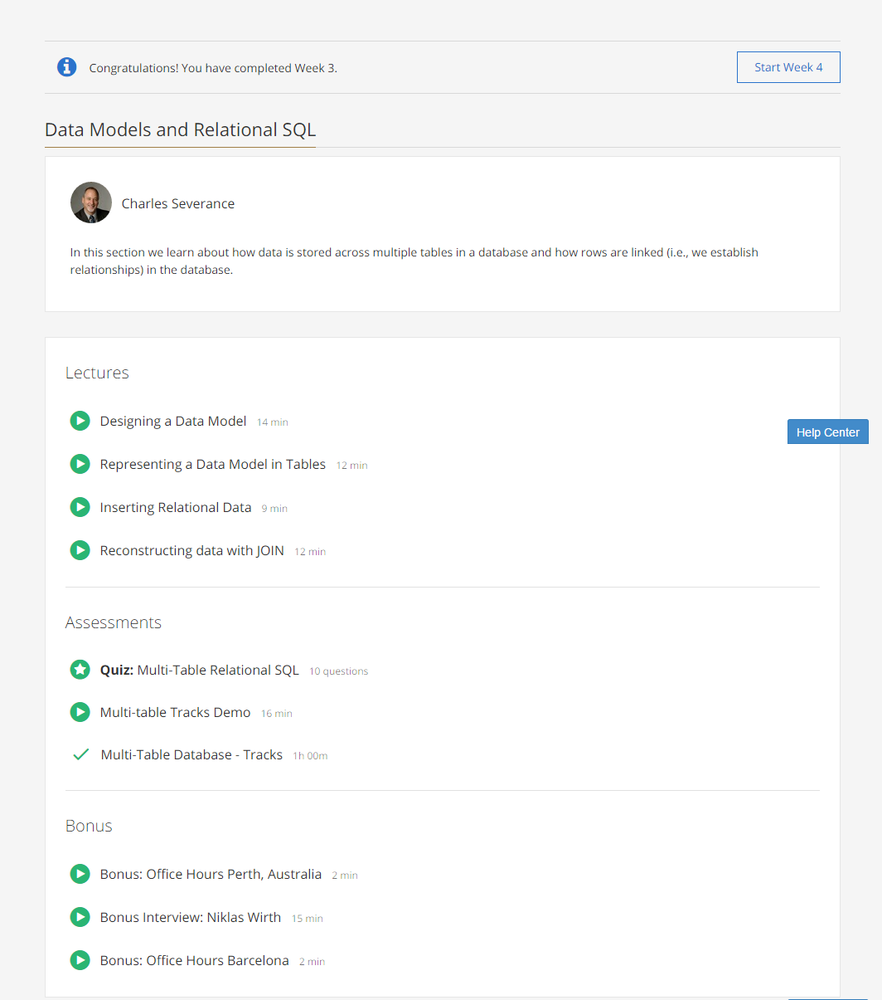

### Week 3: Data Models and Relational SQL

These are the contents of week 3 of the course:  

* **Building a Data Model**:
  * Drawing a picture of the data objects for our application and then figuring out how to represent the objects and their relationships.
  * Basic rule: don't put the same string data in twice - use a relationship instead.
  * When there is one thing in the “real world” there should be one copy of that thing in the database.
  * Start with building the logical model.

* **Representing a Data Model in Tables**:
  * Primary key: Unique key for each entry in the table.
  * Foreign key: Used to indicate relationships to other tables.
  * Logical key: Used to indicate that a field might be used along with `WHERE` or `ORDER BY`.
  * While creating the physical model, start with _outer_ tables first.

* **Inserting Relational Data**:
  * Example of inserting data into a multi-table database.

* **Reconstructing Data with Join**:
  * The `JOIN` operation links data across several tables, making connections based on the `ON` clause.
  * Examples of multi- `JOIN`'s

 

[Back to course notes](../Course_Notes.md)
