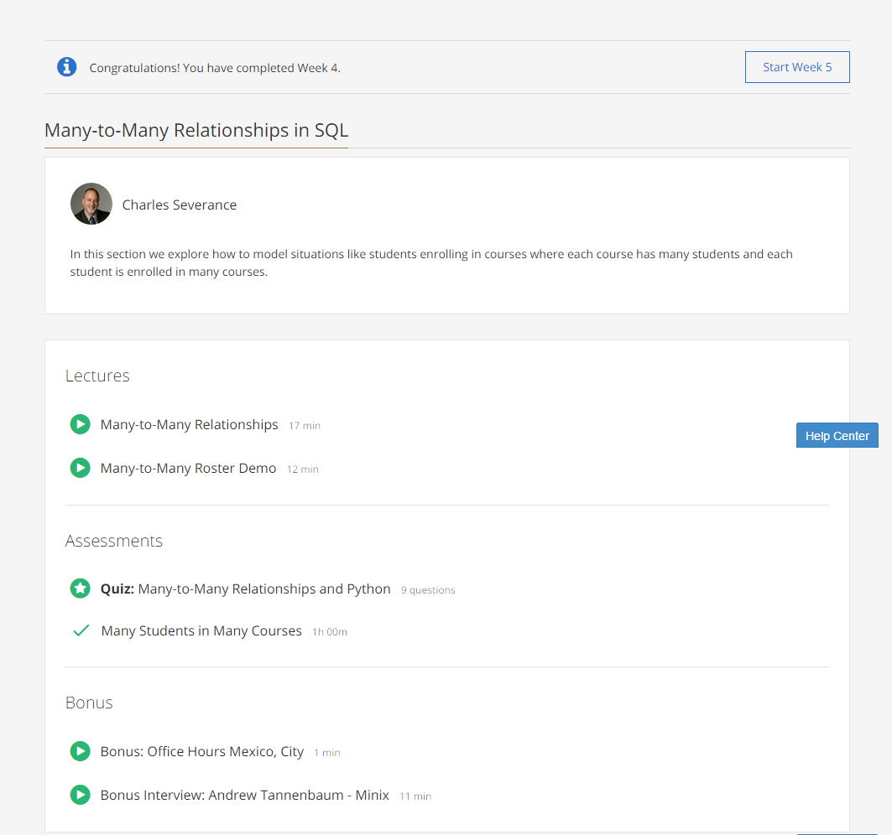

### Week 4: Many-to-Many Relationships in SQL

These are the contents of week 4 of the course:  

* **Many-to-Many Relationships**:
  * A many-to-many relationship can be modeled using a junction table, with one entry for each connection.

 

[Back to course notes](../Course_Notes.md)
